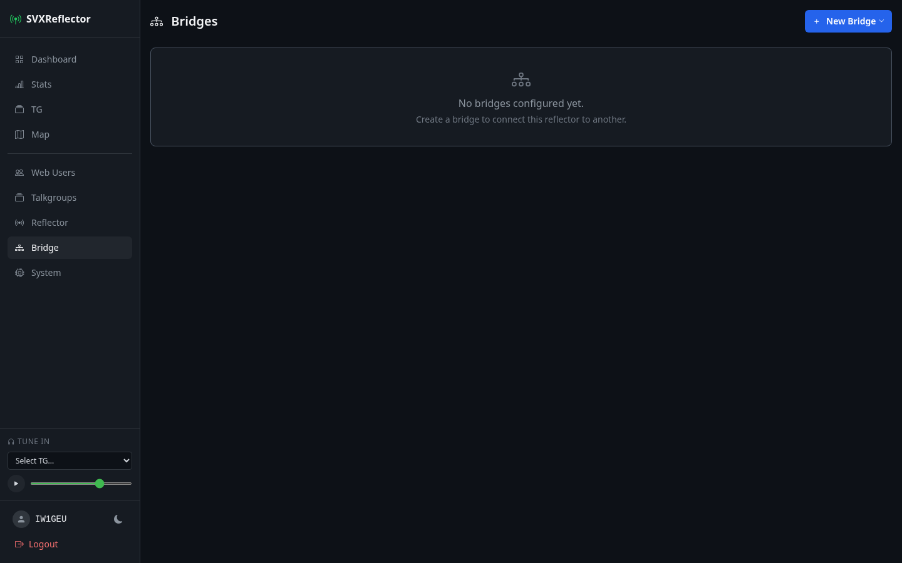

# Bridges



SVXLink bridges connect two audio endpoints — typically a local reflector and a remote reflector or EchoLink network. Each bridge runs as a separate Docker container (`svxlink-bridge-<id>`) with auto-generated configuration files.

## Bridge types

### Reflector bridge

Connects two SVXReflector instances by running two `ReflectorV2` logics linked together. Each bridge has configurable talkgroup mappings that define which local TG maps to which remote TG. The generated config uses `HOSTS` and `HOST_PORT` directives (the modern SVXLink syntax).

Generated files:
- `svxlink.conf` — main SVXLink configuration with both logic sections and link definitions
- `node_info.json` — node metadata (class, location, sysop) sent to the reflector

### EchoLink bridge

Connects a local SVXReflector to the EchoLink network. Runs a `SimplexLogic` hosting the EchoLink module, linked to a `ReflectorV2` logic that connects to the local reflector.

Generated files:
- `svxlink.conf` — main configuration with SimplexLogic, ReflectorLogic, null audio devices, and link
- `ModuleEchoLink.conf` — EchoLink module settings (callsign, password, proxy, access control, description)
- `node_info.json` — node metadata

## Config auto-generation

Every time a bridge is saved (`after_save`), the app:

1. Creates the config directory at `bridge/<id>/`
2. Takes a snapshot backup of existing config files (see [Backups](#backups))
3. Generates `svxlink.conf` (and `ModuleEchoLink.conf` for EchoLink bridges)
4. Writes `node_info.json` with node class, location, and sysop info
5. For reflector bridges with a custom CA bundle or local reflector CA, writes `ca-bundle.crt`

The local reflector's CA bundle is fetched automatically from the running `svxreflector` container via the Docker socket.

## node_info.json

Each bridge writes a `node_info.json` file that the SVXLink process sends to the reflector on connect. Contents:

| Field | Value |
|---|---|
| `nodeClass` | `"echolink"` or `"bridge"` depending on type |
| `nodeLocation` | Custom location string, defaults to bridge name |
| `hidden` | Always `false` |
| `sysop` | Sysop name (optional) |
| `links` | Array of `{localTg, remoteTg}` objects (reflector bridges only) |
| `remoteHost` | Remote reflector hostname (reflector bridges only) |

The `links` and `remoteHost` fields are displayed on the dashboard node cards and map popups, showing which talkgroups the bridge connects.

## Talkgroup mappings (reflector bridges)

Reflector bridges support multiple TG mappings. Each mapping defines:

| Field | Purpose |
|---|---|
| `local_tg` | Talkgroup number on the local reflector |
| `remote_tg` | Talkgroup number on the remote reflector |
| `timeout` | Link timeout in seconds (0 = no timeout) |

Each mapping generates a `[LinkN]` section in `svxlink.conf` with `CONNECT_LOGICS` wiring the two logics together.

## Backups

Config files are backed up as **snapshots** before each save. Snapshots are stored in `bridge/<id>/backups/<YYYYMMDD_HHMMSS>/` and contain copies of all existing config files at that point in time.

- Maximum **10 snapshots** per bridge (oldest pruned automatically)
- Legacy `.bak` files are auto-migrated into the snapshot format on first save
- Snapshots can be viewed from the bridge edit page via the "Configuration Backups" button

## Archive on delete

When a bridge is destroyed, its entire config directory is moved to `bridge/_archive/<id>_<name>_<timestamp>/` instead of being deleted. Archives are retained for **30 days** and then purged automatically.

Purge runs:
- On application boot (via initializer)
- On every bridge save
- On every bridge delete

## PKI and certificates

Reflector bridges can include certificate subject fields (country, org, OU, locality, state, given name, surname, email) that SVXLink uses for TLS client certificate generation.

If the local reflector has a CA bundle (`ca-bundle.crt`), the bridge fetches it automatically and writes a combined CA bundle file. Bridges can also specify a custom `remote_ca_bundle` for the remote reflector's CA.

## File layout

```
bridge/
  <id>/
    svxlink.conf            # Main SVXLink config (auto-generated)
    ModuleEchoLink.conf     # EchoLink module config (EchoLink bridges only)
    node_info.json          # Node metadata
    ca-bundle.crt           # Combined CA bundle (if applicable)
    backups/
      20260307_143022/      # Snapshot directories
        svxlink.conf
        node_info.json
        ModuleEchoLink.conf
      20260307_150510/
        ...
  _archive/                 # Deleted bridge configs (30-day retention)
    3_my-bridge_20260301_120000/
      svxlink.conf
      ...
```
