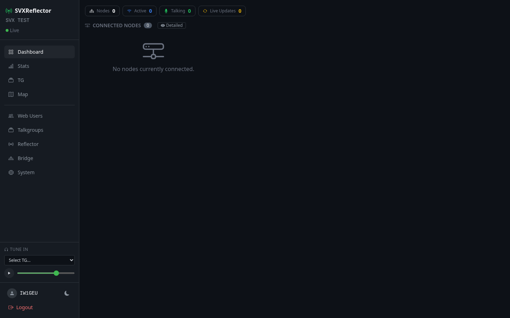
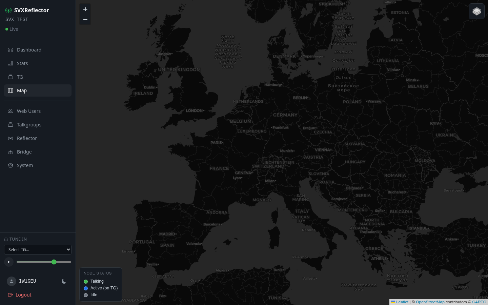
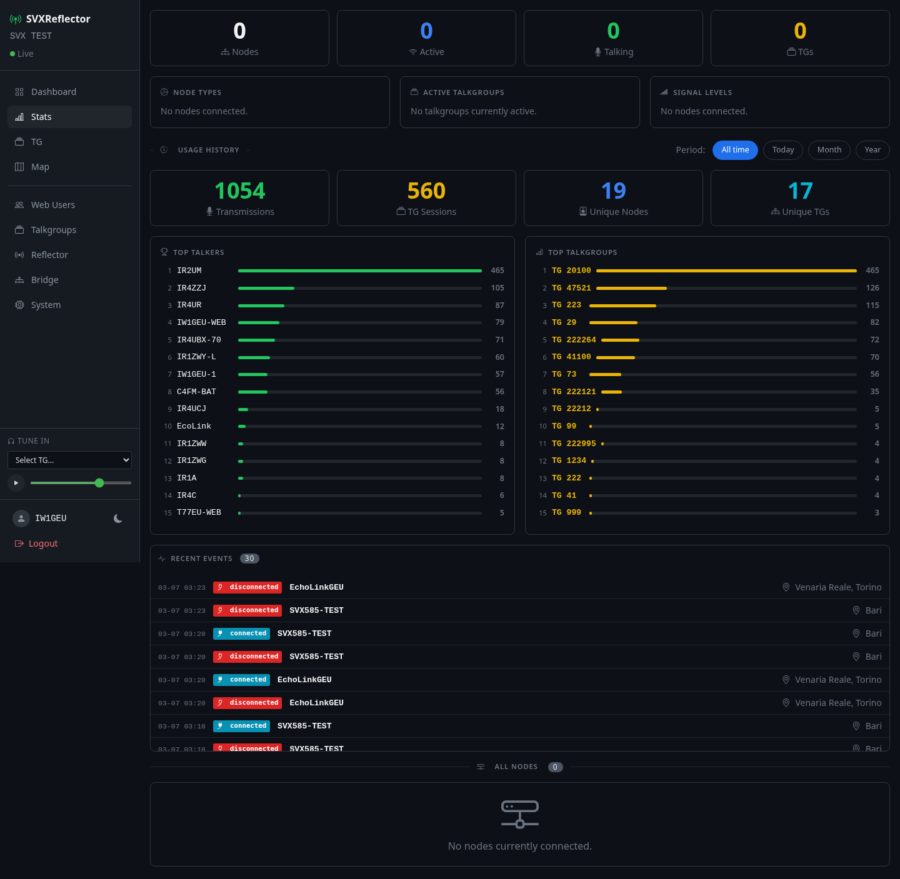
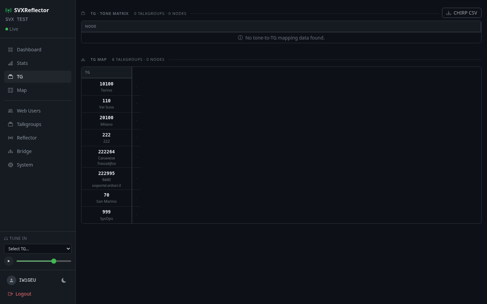
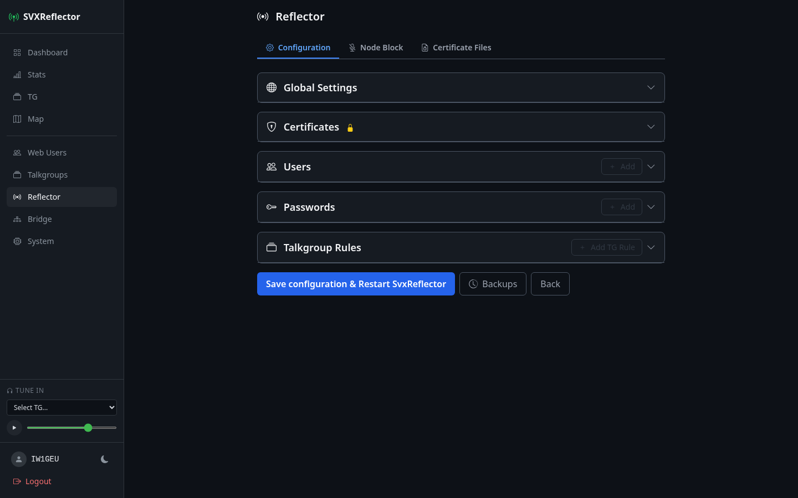
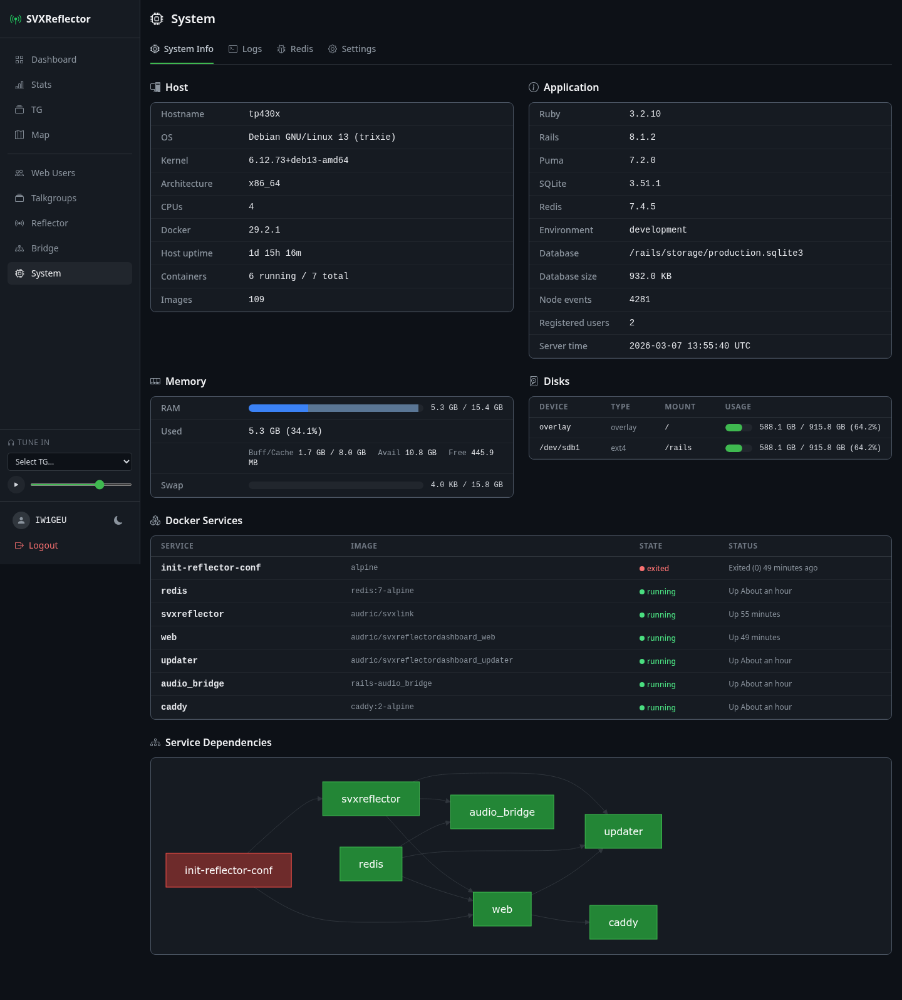

# SVX Dashboard Wiki

Welcome to the SVX Dashboard wiki — the complete reference for deploying, using, and developing the SVX Reflector Dashboard.

## Quick links

- **[[Getting Started]]** — clone, configure, and run in 5 minutes
- **[[Architecture]]** — services, data flow, and audio path
- **[[Configuration]]** — environment variables and settings
- **[[User Management]]** — registration, approval, and permissions
- **[[Bridges]]** — SVXLink bridges (reflector and EchoLink), config generation, backups, and archiving
- **[[Audio Bridge]]** — the Go service that connects browsers to the reflector
- **[[Reflector Protocol]]** — SVXReflector protocol V2 wire format
- **[[Troubleshooting]]** — common issues and fixes
- **[[Code Map]]** — where everything lives in the codebase

## What is SVX Dashboard?

A Rails web application for monitoring amateur radio [SVXReflector](https://www.svxlink.org/) / [GeuReflector](https://github.com/audric/geureflector) node activity in real time. It polls a reflector's HTTP status API, persists node events in SQLite, and pushes live updates to browsers via ActionCable/Redis. Supports GeuReflector extensions: trunk links (server-to-server mesh), cluster TGs (network-wide channels), and satellites (lightweight relays).

Registered users can tune in to talkgroups and transmit audio directly from their browser.

### Features

- **Live dashboard** — node grid with color-coded status, signal levels, squelch indicators, and a scrolling activity log
- **Map** — interactive Leaflet.js map with per-node popups, multiple tile layers, and trunk link status
- **Stats** — historical analytics: top talkers, top talkgroups, node type distribution, signal strength, trunk traffic, cluster TG usage
- **TG Matrix** — CTCSS tone-to-talkgroup mapping table with CHIRP CSV export
- **GeuReflector** — trunk link status panel, satellite monitoring, cluster TG indicators, mode-aware UI (reflector vs satellite)
- **Web listener** — tune in to any talkgroup and receive live Opus audio in the browser
- **Push-to-Talk** — transmit from the browser microphone (requires HTTPS)
- **User accounts** — registration with callsign validation, admin approval, per-user permissions
- **Admin panel** — web user management, registration approval, reflector configuration (global settings, certificates, users, passwords, TG rules, trunk peers, satellites)

### Screenshots

| Dashboard | Map | Stats |
|---|---|---|
|  |  |  |

| TG Matrix | Reflector Config | System Info |
|---|---|---|
|  |  |  |

### Stack

Ruby 3.2 · Rails 8.0 · Go · SQLite · Redis · Hotwire (Turbo + Stimulus) · HAML · Tailwind CSS · Leaflet.js
