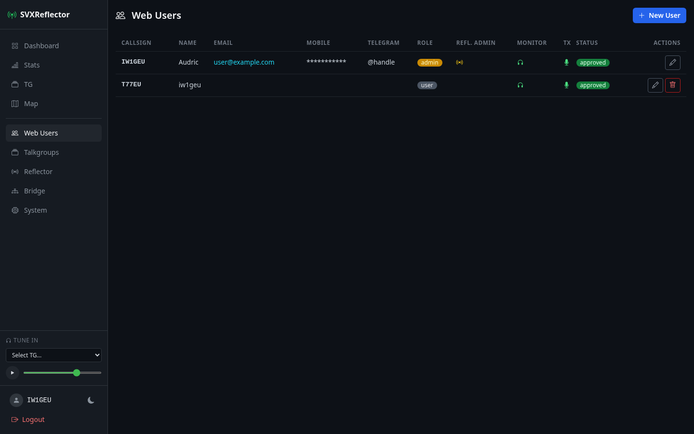

# User Management

## Default admin account

On first boot, `db:seed` creates a default admin:

| Callsign | Password |
|---|---|
| `ADM1N` | `changeme` |

Log in at `/login` and change the password immediately.

## Registration

New users register at `/register`. The registration form requires:

- **Callsign** — must be a valid amateur radio callsign format (e.g. `W1AW`, `KA1ABC`, `VE3XYZ`), max 8 characters
- **Password** — minimum 8 characters

Callsigns are automatically uppercased and validated against the format `/\A[A-Z0-9]{1,3}\d[A-Z]{1,4}\z/`.

New registrations are held in a **pending** state until approved by an admin.

Users can also sign up with a Google account — see [[Google OAuth]] for setup.



## Web Users admin panel

Admins manage web users at `/admin/users`. Available actions:

- **Create** new users directly (pre-approved, no registration needed)
- **Approve** pending registrations
- **Edit** user profile, permissions, and role
- **Delete** user accounts (admins cannot delete themselves)

### User profile fields

| Field | Required | Description |
|---|---|---|
| Callsign | Yes | Amateur radio callsign (auto-uppercased, unique) |
| Password | Yes | Minimum 8 characters |
| Name | No | Display name (also shown as sysop name on the dashboard when listening) |
| Email | No | Contact email |
| Mobile | No | Phone number |
| Telegram | No | Telegram handle |

## Roles

| Role | Description |
|---|---|
| `admin` | Full access to all features and the admin panel (user management, bridges, system info) |
| `user` | Standard user, subject to per-user permissions below |

## Permissions

| Permission | Default | What it allows |
|---|---|---|
| `can_monitor` | Off | Tune in to talkgroups and receive audio |
| `can_transmit` | Off | Use Push-to-Talk to transmit via the reflector |
| `reflector_admin` | Off | Access to reflector configuration at `/admin/reflector` (edit global settings, certificates, users, passwords, TG rules) |
| `cw_roger_beep` | Off | Send callsign in CW (800 Hz, 30 WPM) as roger beep after each PTT transmission |
| `allow_mumble` | Off | Grant a Mumble login on the bundled voice server (see [Mumble access](#mumble-access)) — speaking additionally requires `can_transmit` |
| `reflector_auth_key` | — | Per-user authentication key for the reflector (see below) |

Both `can_monitor` and `can_transmit` default to off for new users and must be explicitly granted by an admin after approval.

## Setting up audio (Tune In and PTT)

Enabling a user to listen to and transmit audio requires configuration on **both** the dashboard and the reflector. This is a two-step process.

### Step 1: Reflector-side — create the web user

Each dashboard user connects to the reflector as `{CALLSIGN}-WEB` (e.g. user `W1AW` connects as `W1AW-WEB`). This callsign must be registered in the reflector's configuration.

Go to `/admin/reflector` (requires reflector admin permission) and add an entry in the **Users** section:

```
W1AW-WEB = MyPasswordGroup
```

This maps the web callsign to a password group. Make sure the password group exists in the **Passwords** section with the corresponding auth key:

```
MyPasswordGroup = s3cretAuthK3y
```

The auth key is what authenticates the web listener to the reflector — it is **not** the user's dashboard login password.

### Step 2: Dashboard-side — configure the user

Edit the user at `/admin/users` and set:

1. **Reflector Auth Key** — paste the same auth key from the reflector's password group (e.g. `s3cretAuthK3y`). The Tune In player is **hidden** until this field is set.
2. **Can monitor** — check this to show the Tune In audio player in the sidebar.
3. **Can transmit** — check this to show the PTT (Push-to-Talk) button next to the player.

### How it works

When a user clicks Play on the Tune In player:

1. The browser opens a WebSocket connection via ActionCable
2. The `AudioChannel` sends a `connect` command to the Go audio bridge via Redis, passing the callsign (`W1AW-WEB`) and auth key
3. The audio bridge establishes a TCP + UDP connection to the reflector and authenticates using the callsign and auth key
4. The bridge subscribes to the selected talkgroup and relays incoming Opus audio frames back through Redis → ActionCable → browser
5. The browser decodes the Opus frames and plays them through the speakers

For PTT (transmit), the flow reverses:

1. The user holds the PTT button — the browser captures microphone audio
2. Audio frames are encoded as Opus and sent via ActionCable → Redis → audio bridge → reflector UDP
3. The reflector distributes the audio to all nodes on the talkgroup

The user appears on the dashboard as a node with callsign `{CALLSIGN}-WEB`, node class `bridge`, and the sysop name from their profile's Name field.

### Quick checklist

To enable audio for a user `F4ABC`:

| Where | What | Value |
|---|---|---|
| Reflector `/admin/reflector` → Users | Add user entry | `F4ABC-WEB = GroupName` |
| Reflector `/admin/reflector` → Passwords | Add/verify password group | `GroupName = theAuthKey` |
| Dashboard `/admin/users` → Edit F4ABC | Reflector Auth Key | `theAuthKey` |
| Dashboard `/admin/users` → Edit F4ABC | Can monitor | Checked |
| Dashboard `/admin/users` → Edit F4ABC | Can transmit | Checked (optional) |

### Reflector admin

The `reflector_admin` permission is separate from the `admin` role. An admin user manages web users, bridges, and system settings. A reflector admin can additionally configure the SVXReflector itself (global settings, certificates, users, passwords, TG rules).

The system enforces that **at least one reflector admin must exist at all times** — you cannot remove the last reflector admin's permission.

### Self-protection

Admins editing their own account cannot change their:
- Callsign
- Role
- Reflector admin status

This prevents accidental lockout.

## Mumble access

If a [[Mumble bridge|Bridges#mumble-bridge]] is configured, users can join the bundled Mumble voice server with any Mumble client and hear/talk on the bridged talkgroup. Access is managed entirely from the dashboard — there is no separate Mumble account to create.

### Granting access

Edit a user at `/admin/users` and check **Allow Mumble**:

- A connection **token** (Mumble password) is minted automatically. It is shown read-only on the user's edit form and on their own account page; disabling **Allow Mumble** wipes it.
- The user's Mumble **username is their callsign**.
- **Speaking** in Mumble requires **Can transmit** (or the `admin` role). Without it, the user can connect and listen but is muted by the server — the voice server applies a *registered-only Enter, transmit-only Speak* ACL by default.

### Self-service connection page

Users with Mumble access get a **My Mumble** link in the navbar leading to `/account`, which shows everything needed to connect:

| Field | Value |
|---|---|
| Server | `MUMBLE_PUBLIC_HOST` (defaults to `DOMAIN`) |
| Port | `MUMBLE_PUBLIC_PORT` (defaults to `64738`) |
| Username | Their callsign |
| Token | Their auto-minted Mumble password |

The page also has a **Regenerate token** button, which mints a fresh token and re-syncs the Mumble server.

### How sync works

User and bridge changes trigger `MumbleSync`, which writes the desired accounts and ACL-group membership straight into the Mumble server's SQLite database (on the shared `mumble_data` volume) and restarts the server. The base ACL is applied idempotently, so a fresh deployment locks down automatically the first time a user or bridge is synced — no manual SQL. See [[Bridges#user-access-model]] for the full model.

## Command-line operations

Useful for production when you can't access the web UI (e.g. locked out of the admin account).

### Change a user's password

```bash
docker compose exec web bin/rails runner '
  u = User.find_by!(callsign: "ADM1N")
  u.update!(password: "newpassword", password_confirmation: "newpassword")
  puts "Password updated for #{u.callsign}"
'
```

### Create a new admin user

```bash
docker compose exec web bin/rails runner '
  User.create!(callsign: "W1AW", password: "securepass", password_confirmation: "securepass", role: "admin", approved: true)
  puts "Admin user created"
'
```

### Approve a pending user

```bash
docker compose exec web bin/rails runner '
  u = User.find_by!(callsign: "F4ABC")
  u.update!(approved: true, can_monitor: true)
  puts "#{u.callsign} approved with monitor permission"
'
```

### List all users

```bash
docker compose exec web bin/rails runner '
  User.all.each { |u| puts "#{u.callsign.ljust(10)} role=#{u.role} approved=#{u.approved?} monitor=#{u.can_monitor} tx=#{u.can_transmit} refl_admin=#{u.reflector_admin}" }
'
```
